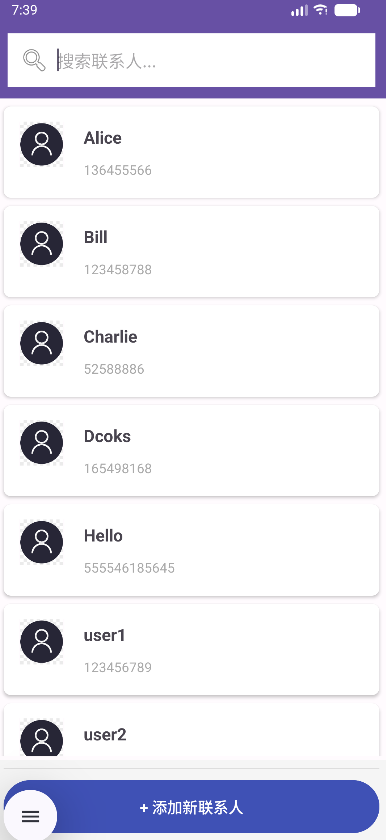

# 📱 Android Contacts Manager

A complete Android contact management application that integrates with the system address book. Built with Java and Android best practices.
<table>
  <tr>
    <td align="center">
      
       
      Add coontacts
    </td>
    <td align="center">
      
       
      Contact details
    </td>
    <td align="center">
      
       
      Mainpage
    </td>
  </tr>
</table>
## ✨ Features

### 🔍 Core Functionalities
- **Contact Management**: Full CRUD operations (Create, Read, Update, Delete)
- **Real-time Search**: Filter contacts by name as you type
- **System Integration**: Access device's native contacts database
- **Quick Actions**: One-tap dialing and messaging
- **Save as New**: Duplicate existing contacts easily

### 🛡️ Technical Highlights
- **Runtime Permissions**: Modern permission handling for Android 6.0+
- **Material Design**: Clean, intuitive interface
- **Performance Optimized**: RecyclerView with ViewHolder pattern
- **Data Safety**: Uses Content Provider for secure system access
- **Version Compatible**: Tested on Android 8.0 through 14

## 📲 Download & Installation

1. Go to the [Releases section](https://github.com/Psychofish-c/AndroidContactList/releases/tag/release)
2. Download the latest `app-debug.apk`
3. Enable "Install from unknown sources" on your Android device
4. Install the APK file

## 🚀 How to Use

### First Launch
1. Grant requested permissions when prompted
2. App automatically loads existing contacts

### Managing Contacts
- **Add**: Tap "+ Add New Contact" button at bottom
- **Search**: Use search bar at top
- **View**: Tap any contact for details
- **Edit**: Press edit button in details
- **Delete**: Long-press or use delete button

### Quick Actions
From contact details:
- 📞 **Call**: Opens dialer with contact's number
- 💬 **SMS**: Opens messaging app
- 💾 **Save as New**: Creates contact copy
- ✏️ **Edit**: Modify information
- 🗑️ **Delete**: Remove from system

## 🛠️ Technical Stack

| Component | Technology |
|-----------|------------|
| Language | Java |
| IDE | Android Studio |
| Database | Android Content Provider |
| Architecture | MVC Pattern |
| UI Framework | Android XML Layouts |

## 📁 Project Structure
app/src/main/java/com/example/mycontacts/

├── MainActivity.java # Main contact list

├── ContactDetailActivity.java # Contact details

├── AddContactActivity.java # Add new contact

├── EditContactActivity.java # Edit contact

├── Contact.java # Data model (Parcelable)

├── ContactsHelper.java # System operations

└── ContactAdapter.java # RecyclerView adapter

## 🤝 Contributing

Suggestions are welcome! If you find bugs or have ideas:
1. Fork the repository
2. Create a feature branch
3. Commit changes
4. Push to branch
5. Open a Pull Request

## 📄 License

Educational project for university course. Feel free to use for learning.

## 🙏 Acknowledgments

**Special Thanks To:**
- [Google Android Team](https://developer.android.com) for providing excellent documentation and development tools
- [Android Studio Community](https://developer.android.com/studio) for the powerful IDE
- [Material Design Guidelines](https://m3.material.io) for UI/UX inspiration
- [Stack Overflow Community](https://stackoverflow.com) for troubleshooting assistance
- University Instructors for project guidance and feedback

**Resources Used:**
- [Android Developers Documentation](https://developer.android.com/docs)
- [Material Design Guidelines](https://m3.material.io)
- [Android Studio User Guide](https://developer.android.com/studio/intro)

**Course Context:**
This project was developed as part of the **Comprehensive Training II** course design at **Hunan University of Science and Technology**, demonstrating practical application of mobile development concepts learned in the curriculum.

**Developed with ❤️ by [Psychofish-c](https://github.com/Psychofish-c)**  
Computer Science Student | Android Developer

---

If you find this project helpful, please give it a ⭐ on GitHub!

---
*Last Updated: December 2024*
